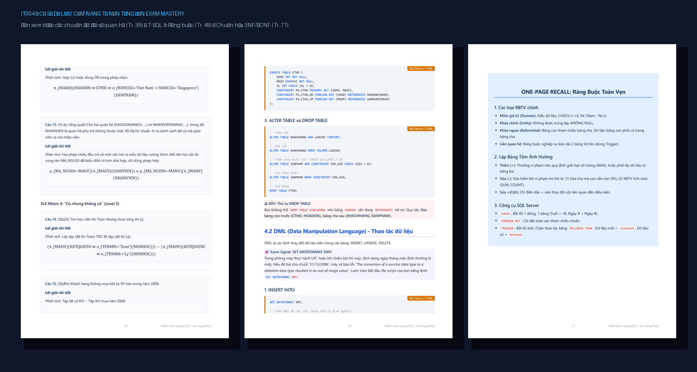
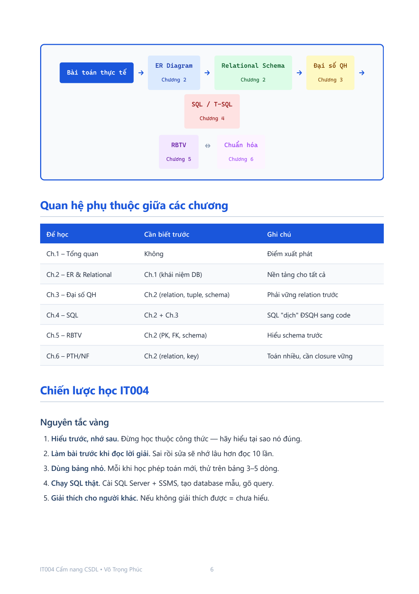

# IT004 – CƠ SỞ DỮ LIỆU
### Cẩm nang từ nền tảng đến Exam Mastery

**Tác giả / Biên soạn:** Võ Trọng Phúc  
**Môn học:** IT004 – Cơ sở dữ liệu (Khoa Hệ thống Thông tin, Trường ĐH Công nghệ Thông tin – ĐHQG-HCM)  
**Ấn bản:** v1.0 • 88 trang A4 • Chuẩn PDF In ấn & Đọc trực tuyến  

---

<div align="center">

[](dist/IT004_CSDL_UIT_CamNang_VoTrongPhuc.pdf)
[](https://phuchello.github.io/CSDL_UIT/)
[](#)

</div>

---

## Giới thiệu tổng quan

**IT004 – Cẩm nang Cơ sở dữ liệu** là tài liệu hệ thống hóa toàn diện, được biên soạn công phu nhằm giúp sinh viên nắm vững bản chất toán học, tư duy thiết kế và kỹ năng thực hành hệ quản trị cơ sở dữ liệu quan hệ (RDBMS). 

Tài liệu được thiết kế theo phương pháp sư phạm 11 bước: đi từ **Trực giác (Intuition) $\rightarrow$ Bản chất toán học $\rightarrow$ Cú pháp T-SQL $\rightarrow$ 30+ Bài tập có lời giải chi tiết $\rightarrow$ Chiến thuật phòng thi (Exam Playbook)**.

<div align="center">
  
</div>

---

## Điểm nổi bật của Cẩm nang

- **Mô hình trực giác (Mental Models)**: Giải thích bản chất dữ liệu, quan hệ, khóa và phép toán trước khi đi vào công thức hình thức.
- **30+ Bài tập Đại số quan hệ phân bậc**: Phân loại từ cơ bản (Chọn, Chiếu, Kết nối) đến nâng cao (Gom nhóm, Phép chia, Không tồn tại), kèm lời giải từng bước rõ ràng.
- **Ràng buộc toàn vẹn & T-SQL Trigger**: Hướng dẫn lập Bảng tầm ảnh hưởng 3 thao tác và viết trigger SQL Server xử lý an toàn đa dòng dữ liệu.
- **Chuẩn hóa quan hệ chuẩn mực**: Thuật toán tìm bao đóng, tìm tất cả khóa tối thiểu, phủ tối thiểu và thuật toán phân rã 3NF / BCNF không mất mát thông tin.
- **Bẫy đề thi & Dấu hiệu nhận diện (Exam Signals & Common Traps)**: Cảnh báo hơn 20 bẫy kinh điển sinh viên UIT hay mắc phải trong phòng thi.
- **Tóm tắt 1 trang (One-Page Recall Sheets)**: Mỗi chương kết thúc bằng 1 trang tóm tắt kiến thức cốt lõi, phục vụ kích hoạt trí nhớ chủ động.
- **Chiến thuật phòng thi (Exam Playbook & Last-Minute Cheat Sheet)**: Phân bổ thời gian thi tự luận 90 phút và thi thực hành máy, kèm bảng cứu cánh tra nhanh trước giờ thi.

---

## Bản đồ lộ trình học tập (Learning Roadmap)

<div align="center">
  
</div>

---

## Mục lục chi tiết

| Phần / Chương | Nội dung trọng tâm | Trang |
| :--- | :--- | :---: |
| **Phần 0: Cách học IT004** | Phương pháp học, bản đồ kiến thức, cấu trúc thi Giữa kỳ / Cuối kỳ và 10 sai lầm thường gặp | 5–10 |
| **Chương 1: Tổng quan CSDL** | Dữ liệu vs Thông tin, kiến trúc 3 mức ANSI/SPARC, tính độc lập dữ liệu, mô hình dữ liệu | 11–16 |
| **Chương 2: Mô hình ER & Quan hệ** | Thực thể, mối kết hợp, thuộc tính, quy tắc ánh xạ ER $\rightarrow$ Relational Schema (1:1, 1:N, N:M) | 17–28 |
| **Chương 3: Đại số quan hệ** | Phép toán tập hợp, Chọn ($\sigma$), Chiếu ($\pi$), Kết nối ($\bowtie$), Phép chia ($\div$), 30 bài tập mẫu có lời giải | 29–46 |
| **Chương 4: SQL & T-SQL Server** | DDL (`CREATE`, `ALTER`), DML (`SELECT`, Subquery, `JOIN`, `GROUP BY`, `EXISTS`), hàm ngày tháng, phân trang | 47–60 |
| **Chương 5: Ràng buộc toàn vẹn** | Phân loại RBTV, Bảng tầm ảnh hưởng 3 thao tác, cài đặt RBTV bằng `CHECK`, `RULE` và Trigger T-SQL | 61–68 |
| **Chương 6: Phụ thuộc hàm & Chuẩn hóa** | Bao đóng $X^+$, tìm tất cả khóa, phủ tối thiểu, 1NF $\rightarrow$ 2NF $\rightarrow$ 3NF $\rightarrow$ BCNF, giải thuật phân rã | 69–76 |
| **Chương 7: Thực hành SQL Server** | Stored Procedure, Function, Cursor, Transaction và phân quyền cơ bản | 77–82 |
| **IT004 Exam Playbook** | Chiến thuật phân bổ thời gian, nhận diện dạng bài, mẹo kiểm tra ngược trong phòng thi | 83–84 |
| **Last-Minute Cheat Sheet** | Bảng cứu cánh tóm lược toàn bộ công thức, cú pháp và quy tắc giải nhanh | 85–86 |
| **Nguồn tham khảo & Colophon** | Danh mục tài liệu đối chiếu học thuật và thông tin xuất bản | 87–88 |

---

## Cấu trúc thư mục kho lưu trữ

```
CSDL_UIT/
├── README.md               # Trang giới thiệu và hướng dẫn tổng quan
├── NOTICE.md               # Thông báo bản quyền và miễn trừ trách nhiệm
├── CHANGELOG.md            # Lịch sử các phiên bản phát hành
├── .gitignore              # Bộ lọc tệp tin không theo dõi
│
├── book/                   # Mã nguồn sách điện tử
│   ├── index.html          # Bản HTML sách hoàn chỉnh (được biên dịch từ các chương)
│   ├── chapters/           # 11 tệp HTML từng chương độc lập
│   └── css/                # Động cơ in ấn CSS A4 (book.css)
│
├── dist/                   # Bản xuất bản chính thức
│   └── IT004_CSDL_UIT_CamNang_VoTrongPhuc.pdf
│
├── assets/                 # Tài nguyên hình ảnh
│   └── preview/            # Ảnh xem trước độ phân giải cao cho GitHub
│
├── scripts/                # Bộ công cụ tự động hóa
│   ├── build.py / ps1      # Script biên dịch book/index.html từ chapters/
│   ├── validate.py / ps1   # Bộ kiểm thử toàn diện cấu trúc & an toàn repo
│   └── generate_previews.py# Script trích xuất ảnh xem trước từ PDF
│
├── research/               # Tài liệu khảo sát & đối chiếu học thuật
│   ├── source_inventory.md # Danh mục giáo trình, đề cương, đề thi tham khảo
│   ├── coverage_matrix.md  # Ma trận bao phủ chuẩn đầu ra môn học
│   ├── source_conflicts.md # Phân tích và thống nhất các mâu thuẫn ký hiệu
│   └── exam_pattern_analysis.md # Phân tích ma trận đề thi UIT 2017–2025
│
├── qa/                     # Hồ sơ kiểm toán & bảo đảm chất lượng
│   ├── academic-audit.md   # Báo cáo thẩm định tính chính xác học thuật
│   ├── publishing-audit.md # Báo cáo chế bản in ấn A4 & hiển thị trực quan
│   ├── final-gate.md       # Biên bản phê duyệt cổng xuất bản chính thức
│   └── integration-report.md # Báo cáo hợp nhất kho lưu trữ canonical
│
├── docs/                   # Tài liệu hướng dẫn chuyên sâu
│   ├── BUILD.md            # Hướng dẫn biên dịch và xuất bản PDF cục bộ
│   ├── METHODOLOGY.md      # Triết lý sư phạm và khung 11 bước biên soạn
│   └── PROJECT_HISTORY.md  # Lịch sử và quá trình hoàn thiện dự án
│
└── .github/workflows/      # Quy trình tự động hóa GitHub Actions
    ├── validate.yml        # CI kiểm tra tính toàn vẹn kho lưu trữ
    └── pages.yml           # CD tự động triển khai sách lên GitHub Pages
```

---

## Hướng dẫn biên dịch và kiểm thử cục bộ

### 1. Yêu cầu cài đặt
- Python 3.10 trở lên
- Các gói thư viện phụ trợ:
  ```bash
  pip install pypdf pypdfium2 pillow lxml
  ```

### 2. Biên dịch lại bản HTML sách
```bash
python scripts/build.py
```

### 3. Chạy bộ kiểm thử tự động (Validation Suite)
```bash
python scripts/validate.py
```

Xem hướng dẫn chi tiết về cấu hình in ấn PDF chất lượng cao tại [docs/BUILD.md](docs/BUILD.md).

---

## Tuyên bố học thuật & Nguồn tham chiếu

Tài liệu được biên soạn và hệ thống hóa dựa trên:
1. **Giáo trình Cơ sở dữ liệu** – PGS.TS. Đồng Thị Bích Thủy, TS. Phạm Thị Bạch Huệ, ThS. Nguyễn Trần Minh Thư (NXB Khoa học & Kỹ thuật).
2. **Slide bài giảng & Đề cương chi tiết IT004** – Khoa Hệ thống Thông tin, Trường ĐH Công nghệ Thông tin – ĐHQG-HCM.
3. **Database System Concepts (7th Edition)** – Silberschatz, Korth, Sudarshan (McGraw-Hill).
4. **Fundamentals of Database Systems (7th Edition)** – Elmasri, Navathe (Pearson).
5. **Tài liệu kỹ thuật Microsoft T-SQL** – Microsoft Learn Technical Documentation.

Chi tiết đối chiếu nguồn xem tại [research/source_inventory.md](research/source_inventory.md).

---

## Bản quyền & Tác giả

- **Biên soạn & Hệ thống hóa:** Võ Trọng Phúc  
- **Bản quyền nội dung:** © 2026 Võ Trọng Phúc. Mọi quyền được bảo lưu theo quy định tại [NOTICE.md](NOTICE.md).
- **Mục đích:** Tài liệu được chia sẻ phi thương mại nhằm hỗ trợ học tập cho sinh viên.
