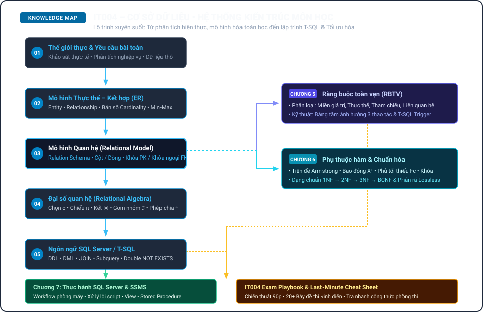

# IT004 · CƠ SỞ DỮ LIỆU
### Cẩm nang từ nền tảng đến Exam Mastery

**ER Modeling • Relational Algebra • SQL Server • Integrity Constraints • Functional Dependencies • Normalization**

Biên soạn: **Võ Trọng Phúc**<br>
*Tài liệu học tập phi thương mại hỗ trợ sinh viên học phần Cơ sở dữ liệu (IT004) – Trường Đại học Công nghệ Thông tin, ĐHQG-HCM.*

---

<div align="center">

[](dist/IT004_CSDL_UIT_CamNang_VoTrongPhuc.pdf)
[](https://phuchello.github.io/CSDL_UIT/)
[](docs/BUILD.md)

<br>

[](https://github.com/Phuchello/CSDL_UIT/actions/workflows/validate.yml)

</div>

---

## Bản đồ kiến thức IT004

Sơ đồ tổng quan luồng kiến thức xuyên suốt môn học: từ phân tích yêu cầu thực tế, mô hình hóa ER, chuyển sang lược đồ quan hệ, truy vấn với Đại số quan hệ / SQL, đến ràng buộc toàn vẹn và chuẩn hóa dữ liệu.

<div align="center">
  
</div>

---

## Nội dung cốt lõi

- **Mô hình hóa thực thể (ER $\rightarrow$ Schema)**: Thực thể, mối kết hợp, thuộc tính, bản số (min, max) và quy tắc ánh xạ chuẩn sang quan hệ (1:1, 1:N, M:N).
- **Đại số quan hệ (Relational Algebra)**: Các phép toán thuần $(\sigma, \pi, \rho, \times, \cup, \cap, -, \div)$ và mở rộng (gom nhóm $\Im$, outer join) cùng 30 bài tập mẫu phân cấp độ có lời giải chi tiết.
- **Truy vấn SQL Server / T-SQL**: Cú pháp DDL, DML, `JOIN`, `GROUP BY`, Correlated Subquery và kỹ thuật giải bài toán "Tất cả" (Universal Queries) qua Double `NOT EXISTS`.
- **Ràng buộc toàn vẹn (RBTV)**: Phân tích ngữ cảnh, phát biểu tân từ, lập Bảng tầm ảnh hưởng 3 thao tác và viết Trigger T-SQL an toàn cho nhiều dòng dữ liệu.
- **Phụ thuộc hàm & Chuẩn hóa (Normalization)**: Hệ tiên đề Armstrong, thuật toán tính bao đóng $X^+$, tìm tập khóa tối thiểu, phủ tối thiểu $F_c$, kiểm tra 1NF $\rightarrow$ 2NF $\rightarrow$ 3NF $\rightarrow$ BCNF và phân rã bảo toàn.
- **Chiến thuật phòng thi & Tra cứu nhanh**: Nhận diện hơn 20 bẫy đề thi hay gặp, phân bổ thời gian làm bài 90 phút và bảng tra cứu cứu cánh trước giờ thi.

---

## Cấu trúc Cẩm nang (Chapter Map)

Cẩm nang được biên soạn cô đọng trong **88 trang A4 tiêu chuẩn**, chia thành 8 chuyên đề trọng tâm kèm các tài liệu bổ trợ:

| Phần / Chương | Ý tưởng cốt lõi | Kỹ năng phòng thi | Trang |
| :--- | :--- | :--- | :---: |
| **Phần 0: Cách học IT004** | Bản đồ tư duy toàn môn, pipeline dữ liệu và 10 sai lầm người mới | Nhận diện cấu trúc đề thi Giữa kỳ & Cuối kỳ | 5–10 |
| **Chương 1: Tổng quan CSDL** | Hệ thống File vs DBMS, kiến trúc 3 mức ANSI/SPARC, tính độc lập dữ liệu | Phân biệt mức ngoài/quan niệm/trong, độc lập logic vs vật lý | 11–18 |
| **Chương 2: Mô hình ER & Quan hệ** | Entity, Relationship, Min-Max, quy tắc ánh xạ 1:1, 1:N, M:N | Vẽ ERD chuẩn xác, chuyển dịch sang Lược đồ quan hệ có PK/FK | 19–26 |
| **Chương 3: Đại số quan hệ** | Ngôn ngữ thủ tục: $\sigma, \pi, \rho, \bowtie, \cup, \cap, -, \div, \Im$ | Giải nhanh 30 bài tập mẫu từ cơ bản đến cực trị & phép chia | 27–46 |
| **Chương 4: SQL Server / T-SQL** | Ngôn ngữ khai báo: DDL, DML, `JOIN`, `GROUP BY`, Subquery, Ngày tháng | Cú pháp Double `NOT EXISTS`, `HAVING`, xử lý `NULL` và bẫy `JOIN` | 47–61 |
| **Chương 5: Ràng buộc toàn vẹn** | Bảo vệ tính nhất quán dữ liệu, phân loại RBTV, Bảng tầm ảnh hưởng | Phát biểu tân từ, lập bảng tầm ảnh hưởng, viết Trigger T-SQL | 62–71 |
| **Chương 6: PTH & Chuẩn hóa** | Armstrong, bao đóng $X^+$, tìm khóa, phủ tối thiểu $F_c$, 1NF $\rightarrow$ BCNF | Tìm tất cả khóa ứng viên, xác định dạng chuẩn cao nhất, phân rã | 72–76 |
| **Chương 7: Thực hành SQL Server** | Môi trường SSMS, tạo DB từ script, bảng lỗi thường gặp và mẹo lab | Quy trình gỡ lỗi phòng máy, viết Stored Procedure & Trigger | 77–82 |
| **IT004 Exam Playbook** | Checklist 60 giây cho ER, ma trận từ khóa $\rightarrow$ phép toán ĐSQH/SQL | Phân bổ thời gian 90 phút, chiến thuật kiểm tra ngược bài làm | 83–84 |
| **Last-Minute Cheat Sheet** | Tóm lược cô đọng toàn bộ công thức, định nghĩa và mẹo giải nhanh | Cứu cánh tra cứu nhanh trước giờ vào phòng thi | 85–86 |
| **Nguồn tham khảo & Colophon** | Danh mục tài liệu học thuật đối chiếu và thông tin biên soạn | Tra cứu tài liệu gốc, slide bài giảng và giáo trình chuẩn | 87–88 |

---

## Phương pháp trình bày

Mỗi chủ đề trong cẩm nang được hệ thống hóa trực quan:

- 🧠 **Mental Models**: Trực quan hóa bản chất khái niệm bằng các hình ảnh gần gũi trước khi đi vào công thức toán học.
- ⚡ **Fast Patterns**: Đúc kết quy tắc nhận diện mẫu câu hỏi và hướng giải quyết ngắn gọn.
- ☢️ **Common Traps**: Cảnh báo các bẫy đề thi và lỗi sai ngữ nghĩa sinh viên thường mắc phải.
- 🎯 **Exam Signals**: Tín hiệu từ khóa trong đề thi giúp định hướng ngay phép toán cần sử dụng.
- 🏃 **Dry Runs**: Bảng chạy khô từng bước cho các giải thuật bao đóng, tìm khóa, phép chia.
- 📝 **30+ Bài tập có lời giải**: Tuyển tập bài tập ĐSQH và SQL phân bậc kèm phân tích chi tiết.
- 📋 **One-Page Recall**: Bảng tổng kết 1 trang cuối mỗi chương để ôn tập nhanh.
- ⏱️ **Exam Playbook**: Chiến thuật phân bổ thời gian và mẹo xử lý đề thi 90 phút.

---

## Khởi động & Biên dịch nhanh (Quick Start)

Kho lưu trữ hỗ trợ công cụ tự động hóa để biên dịch và kiểm thử tài liệu:

```bash
# 1. Biên dịch lại toàn bộ sách thành 1 tệp HTML hoàn chỉnh
python scripts/build.py

# 2. Chạy bộ kiểm thử tự động toàn diện (Validation Suite)
python scripts/validate.py
```

*Xem hướng dẫn chi tiết về cấu hình in ấn PDF và kích hoạt Pages tại [docs/BUILD.md](docs/BUILD.md).*

---

## Cấu trúc Kho lưu trữ (Project Structure)

```
CSDL_UIT/
├── book/          # Mã nguồn HTML các chương & CSS động cơ in ấn A4
├── dist/          # Tệp PDF ấn bản chính thức (88 trang A4)
├── research/      # Danh mục đối chiếu nguồn học thuật & ma trận đề thi
├── scripts/       # Bộ công cụ build & kiểm thử tự động (Python / PowerShell)
├── docs/          # Tài liệu hướng dẫn biên dịch, phương pháp & lịch sử dự án
└── qa/            # Hồ sơ kiểm toán học thuật & chế bản in ấn
```

---

## Nguồn Tham chiếu & Tuyên bố Học thuật

Tài liệu được biên soạn và hệ thống hóa dựa trên:
1. **Giáo trình Cơ sở dữ liệu** – PGS.TS. Đồng Thị Bích Thủy, TS. Phạm Thị Bạch Huệ, ThS. Nguyễn Trần Minh Thư (NXB Khoa học & Kỹ thuật).
2. **Slide bài giảng & Đề cương môn học IT004** – Khoa Hệ thống Thông tin, Trường ĐH Công nghệ Thông tin – ĐHQG-HCM.
3. **Database System Concepts (7th Edition)** – Silberschatz, Korth, Sudarshan (McGraw-Hill).
4. **Fundamentals of Database Systems (7th Edition)** – Elmasri, Navathe (Pearson).
5. **Tài liệu kỹ thuật Microsoft T-SQL** – Microsoft Learn Technical Documentation.

Chi tiết đối chiếu nguồn xem tại [research/source_inventory.md](research/source_inventory.md).

> **Lưu ý**: Đây là tài liệu học tập được biên soạn độc lập phi thương mại, không phải ấn bản chính thức của Trường Đại học Công nghệ Thông tin – ĐHQG-HCM.

---

## Tác giả & Bản quyền

- **Biên soạn & Hệ thống hóa:** Võ Trọng Phúc
- **Bản quyền:** © 2026 Võ Trọng Phúc. Toàn bộ quyền được bảo lưu theo quy định tại [NOTICE.md](NOTICE.md).
- **Lịch sử cập nhật:** [CHANGELOG.md](CHANGELOG.md)
